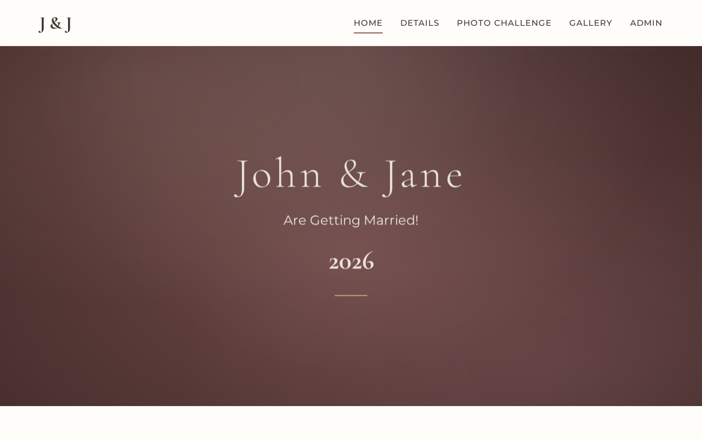
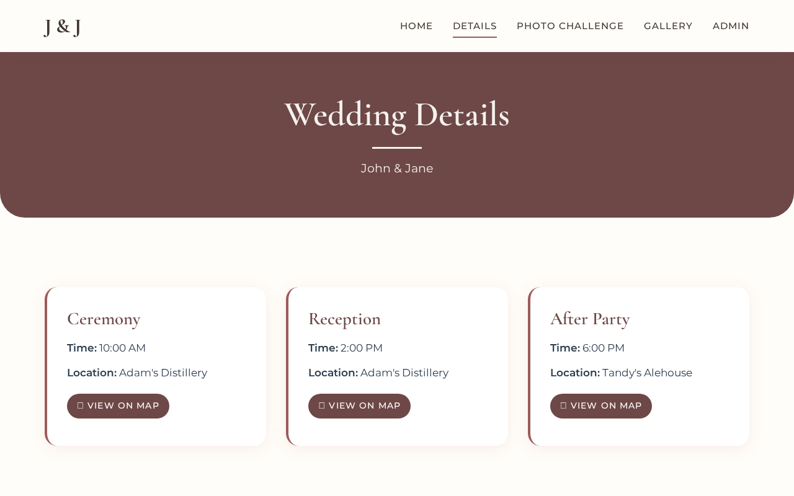
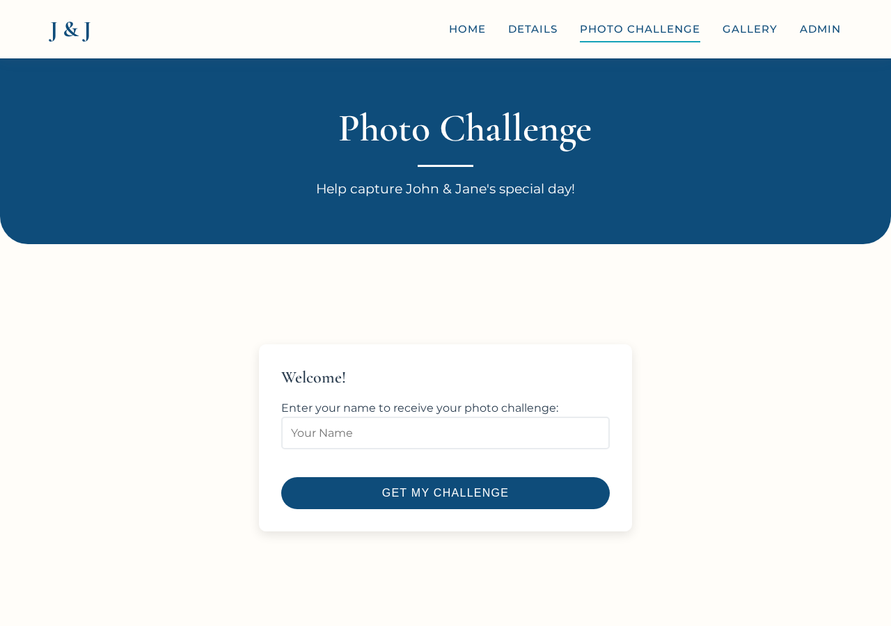
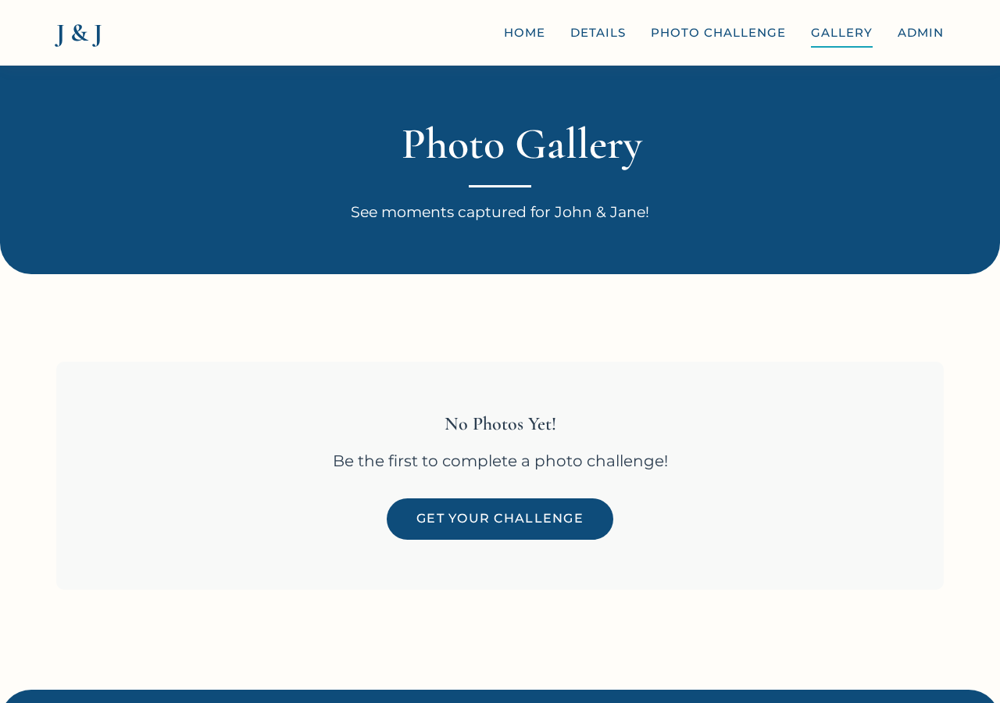
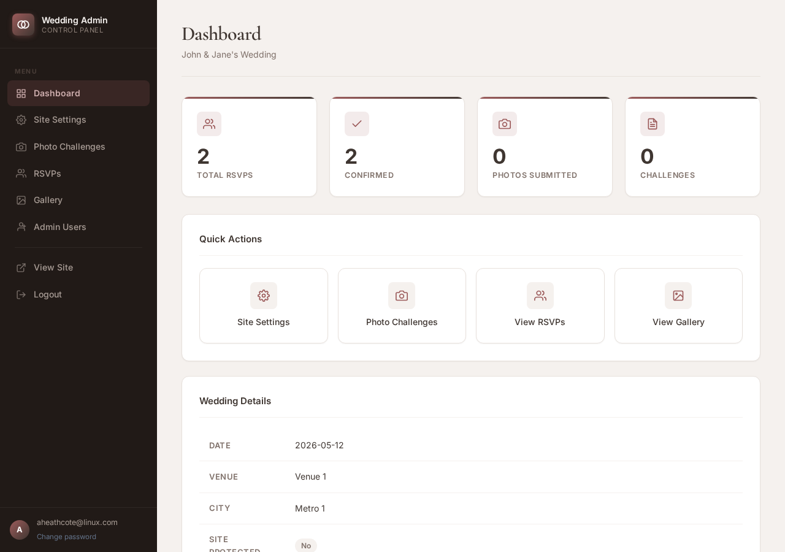
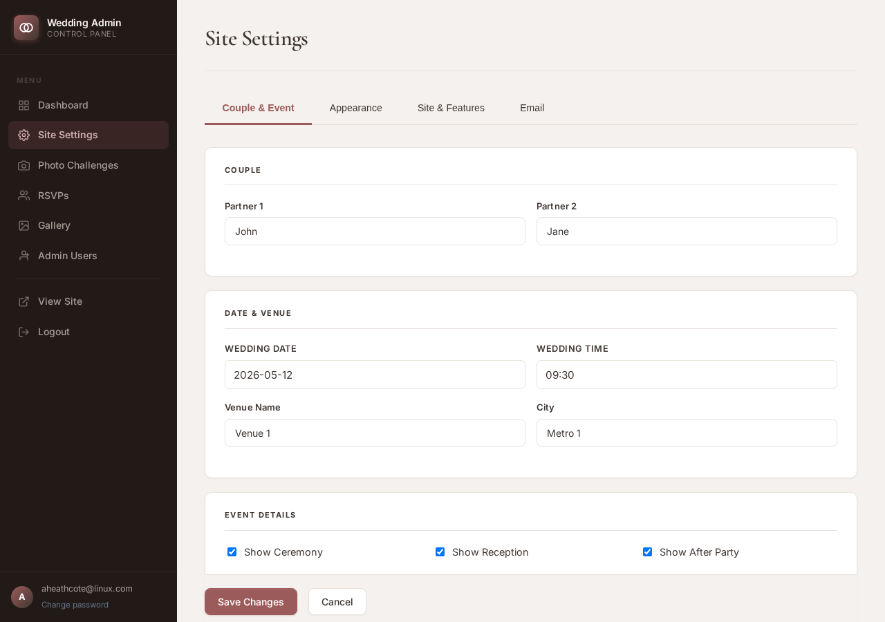

<picture>
  <source media="(prefers-color-scheme: dark)" srcset="matrimony-logo-light.svg">
  
</picture>

# Your very own wedding website!

A beautiful, easy-to-deploy wedding website for you and your partner. Guests can save the date, confirm their RSVP, and take part in a wedding-day photo challenge - all managed through a simple admin panel.
## Screenshots

| Home | Details |
|------|---------|
|  |  |

| Photo Challenge | Gallery |
|-----------------|---------|
|  |  |

| Admin Dashboard | Wedding Settings |
|-----------------|-----------------|
|  |  |

## Features

- **Wedding pages** for home, details, and live stream
- **Simple admin panel** to manage all your wedding settings
- **Save the Date** form to collect guest contact details before the big day
- **Personalised RSVP links** - each guest gets a unique QR code for one-click confirmation
- **Time-locked photo challenge** that unlocks automatically on your wedding day
- **Photo gallery** of guest-submitted challenge photos, downloadable as a ZIP
- **Email notifications** when guests save the date or confirm their RSVP
- **Customisable themes** - choose from classic, editorial, minimal, romantic, or luxe layouts, with full colour control
- Optional **site password** to keep guest pages private until you're ready to share

## Getting Started

### 1. Create a virtual environment

```bash
python -m venv venv
source venv/bin/activate
```

### 2. Install dependencies

```bash
pip install -r requirements.txt
```

### 3. Create your config file

```bash
cp config.example.yml config.yml
```

Open `config.yml` and fill in two things:

- A **secret key** for secure sessions (any long random string)
- Your **database connection** details (host, user, password, database name)

### 4. Set up the database

```bash
python setup_database.py
```

### 5. Run the app

```bash
python app.py
```

Open `http://localhost:5000` in your browser. On first run you'll be walked through a short setup wizard to create your admin account and enter your initial wedding details.

## Admin Panel

Once you're logged in at `/admin` you can manage everything from the browser:

- **Wedding details** - couple names, date & time, venue info, registry links, Twitch stream
- **Theme & colours** - 5 layout styles and full colour customisation
- **Photo challenges** - add, edit, or remove challenges for your guests
- **Guest list** - view RSVPs, import/export CSV
- **Photo gallery** - browse and download everything guests submitted
- **Site settings** - password protection and email (SMTP) configuration

## Tech Stack

- **Backend:** Flask, Flask-Mail, Flask-SQLAlchemy
- **Database:** MariaDB/MySQL
- **Frontend:** Jinja2 templates, custom CSS, vanilla JavaScript

## Production

Run with Gunicorn:

```bash
gunicorn -w 4 -b 0.0.0.0:8000 app:app
```

## AI Disclaimer
Development of this site made heavy use of AI (Claude Sonnet 4.6) to take it from a custom and highly specific site for myself and my wife to something generic enough for anyone to use.
The original site had no admin panel and was driven purely by database entries and YAML config files.
